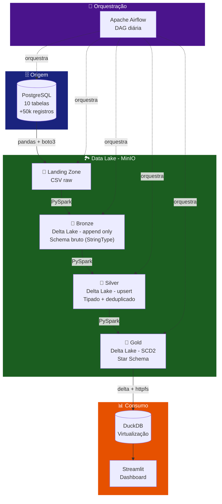

# 🏗️ Arquitetura Geral

## Visão Macro

O projeto segue a **Arquitetura Medalhão** (Medallion Architecture), um padrão amplamente adotado em plataformas de dados modernas. A arquitetura organiza os dados em camadas progressivas de qualidade e refinamento.

---

## Camadas do Data Lake

### 📂 Landing Zone

!!! info "Formato: CSV (bruto)"
    Os dados são extraídos do PostgreSQL e salvos em formato CSV bruto no MinIO. Nenhuma transformação é aplicada.

- **Bucket:** `s3a://landing/`
- **Formato:** CSV com header
- **Nomenclatura:** `<tabela>/<tabela>_raw.csv`
- **Responsável:** DAG Airflow (`ingestao_landing_zone.py`)

### 🥉 Bronze

!!! info "Formato: Delta Lake (append-only)"
    Dados brutos convertidos para Delta Lake. Todas as colunas mantidas como `StringType`.

- **Bucket:** `s3a://bronze/`
- **Modo de escrita:** `APPEND` (acumula histórico)
- **Schema:** Todas as colunas como `StringType`
- **Colunas de auditoria:** `_ingestion_timestamp`, `_source_file`, `_source_table`
- **Responsável:** `pipeline/landing_to_bronze.py`

### 🥈 Silver

!!! info "Formato: Delta Lake (upsert via MERGE)"
    Dados limpos, tipados e deduplicados. Reflete o estado atual de cada entidade.

- **Bucket:** `s3a://silver/`
- **Modo de escrita:** `MERGE` (upsert por chave primária)
- **Schema:** Tipos corretos (`IntegerType`, `DecimalType`, `TimestampType`, etc.)
- **Transformações:** Deduplicação, Tipagem, Regras de qualidade
- **Coluna de auditoria:** `_silver_processed_at`
- **Responsável:** `pipeline/bronze_to_silver.py`

### 🥇 Gold

!!! info "Formato: Delta Lake (Star Schema + SCD Tipo 2)"
    Modelo dimensional otimizado para análise. Dimensões com SCD2 e fato vendas com checkpoints.

- **Bucket:** `s3a://gold/`
- **Dimensões:** `dim_clientes`, `dim_lojas`, `dim_produtos`, `dim_vendedores`, `dim_metodos_pagamento`
- **Fatos:** `fato_vendas` (grão: item de pedido)
- **Controle:** `checkpoints/fato_vendas` (watermark incremental)
- **Responsável:** `gold/run_dimensions.py` + `gold/facts/fato_vendas.py`

---

## Princípios Arquiteturais

| Princípio | Implementação |
|---|---|
| **Imutabilidade** | Bronze nunca sobrescreve, apenas append |
| **Idempotência** | Checkpoints impedem duplicação entre execuções |
| **Rastreabilidade** | Colunas de auditoria em todas as camadas |
| **Qualidade** | Regras de validação na Silver |
| **Historicidade** | SCD Tipo 2 nas dimensões Gold |
| **Atomicidade** | Transações ACID via Delta Lake |
