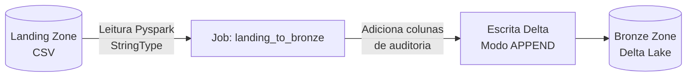

# 🥉 Camada Bronze (Landing → Bronze)

A camada **Bronze** é a primeira camada de armazenamento em formato analítico do Data Lake. Ela representa o dado bruto **sem transformação**, gravado em formato **Delta Lake** para garantir controle transacional (ACID).

---

## 🎯 Responsabilidade

A Bronze tem uma única responsabilidade:

1.  **Ler o CSV** da Landing Zone exatamente como ele chega da origem — sem casting de tipo, sem regra de negócio, sem deduplicação.
2.  **Adicionar colunas de auditoria** que registram quando e de onde o dado entrou no Lake.
3.  **Gravar em Delta Lake** no modo `APPEND` — a Bronze acumula histórico de toda extração, nunca sobrescreve.

### Fluxo de Transformação



---

## 🔍 Colunas de Auditoria

Cada registro na Bronze recebe automaticamente as seguintes colunas de controle, essenciais para rastreabilidade:

| Coluna | Tipo | Descrição |
|--------|------|-----------|
| `_ingestion_timestamp` | `timestamp` | Data/hora exata em que o registro entrou na Bronze |
| `_source_file` | `string` | Caminho completo do arquivo CSV de origem |
| `_source_table` | `string` | Nome da tabela de origem (ex: `pedidos`, `clientes`) |

---

## 🧩 Schema Bruto (StringType)

!!! warning "Importante"
    Todas as colunas na Bronze são mantidas como `StringType`, preservando a fidelidade do dado original.

A conversão para tipos corretos (`IntegerType`, `DecimalType`, `TimestampType`, etc.) ocorre **apenas na camada Silver**. Essa decisão segue o princípio da Arquitetura Medalhão: **Bronze = raw, Silver = tipado e limpo**.

---

## ⚙️ Como Executar

=== "Processar Tabela Específica"

    ```bash
    spark-submit pipeline/landing_to_bronze.py --table pedidos
    ```

=== "Processar Todas (Desenvolvimento)"

    Conveniente para testes locais, processa as 10 tabelas de uma vez:
    ```bash
    python pipeline/run_all_tables.py bronze
    ```

---

## 💾 Armazenamento

Os dados são gravados no MinIO no path:

```
s3a://bronze/<nome_da_tabela>/
```

**Exemplos:**
*   `s3a://bronze/pedidos/`
*   `s3a://bronze/clientes/`
