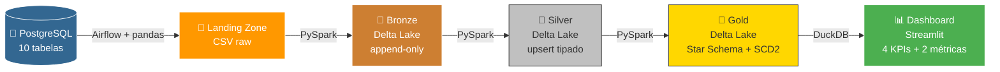

---
hide:
  - navigation
---

# 🚀 Pipeline de Engenharia de Dados — E-commerce

<div style="text-align: center; margin: 2em 0;">
<strong>Projeto Final de Engenharia de Dados</strong><br>
<em>Arquitetura Medalhão completa com orquestração, processamento distribuído e dashboard analítico</em>
</div>

---

## 📋 Visão Geral

Este projeto implementa um **pipeline de dados completo** para um e-commerce sintético, desde a geração de dados até a visualização em dashboard. A arquitetura segue o padrão **Medalhão** (Landing → Bronze → Silver → Gold) sobre um Data Lake local.

!!! success "Requisitos Atendidos"
    - [x] 10 tabelas na origem com ≥10.000 linhas
    - [x] Orquestração via Apache Airflow (sem cron/agendador)
    - [x] Data Lake em Object Storage (MinIO)
    - [x] Dados em Delta Lake (Bronze, Silver, Gold)
    - [x] Landing em formato bruto (CSV)
    - [x] Motor Apache Spark (PySpark)
    - [x] Gold em modelo dimensional (fatos + dimensões)
    - [x] SCD Tipo 2 nas dimensões
    - [x] Checkpoints para carga incremental
    - [x] 4 KPIs + 2 métricas (Dashboard One Page View)
    - [x] Publicado no GitHub com Pull Requests
    - [x] Documentação MkDocs completa

---

## 🏗️ Arquitetura do Pipeline



---

## 🛠️ Stack Tecnológica

| Camada | Tecnologia | Versão |
|---|---|---|
| 🗄️ Origem | PostgreSQL | 15 |
| 📦 Object Storage | MinIO (S3-compatible) | latest |
| ⚡ Processamento | PySpark + Delta Lake | 3.5.1 + 3.2.0 |
| 🔄 Orquestração | Apache Airflow | 2.9.1 |
| 🔍 Virtualização | DuckDB | 1.1.3 |
| 📊 Dashboard | Streamlit + Plotly | 1.35.0 + 5.22.0 |
| 📦 Pacotes | UV | latest |
| 🐳 Infra | Docker Compose | — |
| 📄 Documentação | MkDocs Material | latest |

---

## 🐳 Serviços Docker

| Serviço | URL | Credenciais | Descrição |
|---|---|---|---|
| **Airflow** | [localhost:8080](http://localhost:8080) | `admin` / `admin` | Orquestração do pipeline |
| **MinIO Console** | [localhost:9001](http://localhost:9001) | `admin` / `adminpassword` | Interface do Data Lake |
| **MkDocs** | [localhost:8000](http://localhost:8000) | — | Esta documentação |
| **Metabase** | [localhost:3000](http://localhost:3000) | — | Dashboard BI |
| **PostgreSQL** | `localhost:5432` | `postgres` / `admin123` | Banco de origem |

---

## 🚀 Quick Start

```bash
# 1. Clone o repositório
git clone https://github.com/brunotesckemartins/trabalho-final-eng-dados.git
cd trabalho-final-eng-dados

# 2. Configure o ambiente
cp .env.example .env

# 3. Instale dependências Python
uv sync

# 4. Suba a infraestrutura
docker compose up -d

# 5. Gere os dados sintéticos
python scripts/faker_generator.py

# 6. Acesse o Airflow e dispare a DAG
# http://localhost:8080 → admin/admin

# 7. Após a DAG concluir, inicie o dashboard
uv run streamlit run visualization/dashboard.py
```

!!! tip "Primeira execução"
    Na primeira execução, a imagem do Airflow será construída (5-10 min). Nas seguintes, será instantâneo.

---

## 📂 Navegação da Documentação

<div class="grid cards" markdown>

- :material-database-import:{ .lg .middle } **Ingestão**

    Extração do PostgreSQL e carga na Landing Zone

    [:octicons-arrow-right-24: Origem dos Dados](origem_dados.md)

    [:octicons-arrow-right-24: Landing Zone](ingestao_landing.md)

- :material-layers-triple:{ .lg .middle } **Transformação**

    Processamento Spark nas camadas Bronze e Silver

    [:octicons-arrow-right-24: Camada Bronze](bronze.md)

    [:octicons-arrow-right-24: Camada Silver](silver.md)

- :material-star:{ .lg .middle } **Modelagem Gold**

    Star Schema com SCD Tipo 2 e checkpoints

    [:octicons-arrow-right-24: Dimensões SCD2](dimensoes.md)

    [:octicons-arrow-right-24: Fato Vendas](fato_vendas.md)

- :material-chart-bar:{ .lg .middle } **Visualização**

    Dashboard com KPIs e métricas analíticas

    [:octicons-arrow-right-24: Dashboard](visualizacao.md)

</div>
