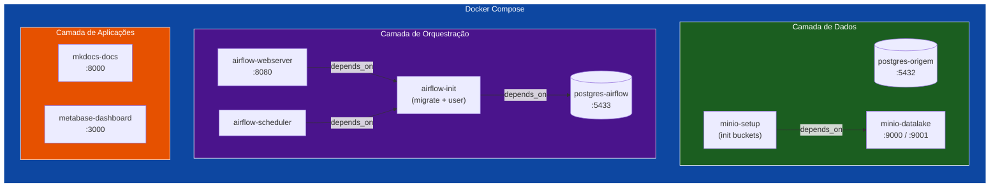

# 🐳 Infraestrutura Docker

Toda a infraestrutura do projeto é provisionada via **Docker Compose**, garantindo reprodutibilidade e isolamento do ambiente.

---

## Diagrama de Serviços

---

## Serviços Detalhados

### 1. PostgreSQL — Banco de Origem

!!! note "Serviço: `postgres-origem`"
    Banco relacional que simula o ambiente transacional do e-commerce.

| Propriedade | Valor |
|---|---|
| **Imagem** | `postgres:15` |
| **Container** | `postgres-origem` |
| **Porta** | `5432:5432` |
| **Banco** | `ecommerce_db` |
| **Usuário** | `postgres` / `admin123` |
| **Volume** | `pgdata_origem` + `init_schema.sql` |

O schema é criado automaticamente na primeira inicialização via `init_schema.sql` montado em `/docker-entrypoint-initdb.d/`.

---

### 2. MinIO — Data Lake (Object Storage)

!!! note "Serviço: `minio`"
    Object Storage S3-compatível que funciona como nosso Data Lake local.

| Propriedade | Valor |
|---|---|
| **Imagem** | `minio/minio:latest` |
| **Container** | `minio-datalake` |
| **Porta API** | `9000:9000` |
| **Porta Console** | `9001:9001` |
| **Credenciais** | `admin` / `adminpassword` |
| **Volume** | `minio_data` |

!!! tip "Buckets criados automaticamente"
    O container `minio-setup` cria os buckets da arquitetura medalhão:
    `landing`, `bronze`, `silver`, `gold`

---

### 3. Apache Airflow — Orquestração

!!! note "Serviços: `postgres-airflow`, `airflow-init`, `airflow-webserver`, `airflow-scheduler`"
    Orquestrador de tarefas que automatiza todo o pipeline de dados.

| Componente | Porta | Função |
|---|---|---|
| `postgres-airflow` | `5433` | Banco metadados do Airflow |
| `airflow-init` | — | Migração do banco + criação do usuário admin |
| `airflow-webserver` | `8080` | Interface web (UI) |
| `airflow-scheduler` | — | Agendador de DAGs |

**Credenciais de acesso:** `admin` / `admin`

!!! warning "Imagem customizada"
    O Airflow usa um `Dockerfile.airflow` customizado que instala:
    
    - **OpenJDK 17** — necessário para o PySpark rodar sobre a JVM
    - **PySpark 3.5.1** + **Delta Spark 3.2.0** — processamento de dados
    - **pandas**, **boto3**, **psycopg2-binary** — extração e carga

---

### 4. MkDocs — Documentação

| Propriedade | Valor |
|---|---|
| **Imagem** | `squidfunk/mkdocs-material:latest` |
| **Container** | `mkdocs-docs` |
| **Porta** | `8000:8000` |
| **Volume** | `.:/docs` |

---

### 5. Metabase — Dashboard BI

| Propriedade | Valor |
|---|---|
| **Imagem** | `metabase/metabase:latest` |
| **Container** | `metabase-dashboard` |
| **Porta** | `3000:3000` |
| **Volume** | `metabase_data` |

---

## Volumes Persistentes

| Volume | Serviço | Conteúdo |
|---|---|---|
| `pgdata_origem` | postgres-origem | Dados do banco e-commerce |
| `pgdata_airflow` | postgres-airflow | Metadados do Airflow |
| `minio_data` | minio | Buckets do Data Lake |
| `metabase_data` | metabase | Configurações do Metabase |

---

## Mapa de Portas

| Porta Host | Porta Container | Serviço |
|---|---|---|
| 3000 | 3000 | Metabase |
| 5432 | 5432 | PostgreSQL (origem) |
| 5433 | 5432 | PostgreSQL (Airflow) |
| 8000 | 8000 | MkDocs |
| 8080 | 8080 | Airflow Webserver |
| 9000 | 9000 | MinIO API |
| 9001 | 9001 | MinIO Console |

---

## Troubleshooting

??? question "O Airflow não inicia?"
    1. Verifique se o `airflow-init` finalizou: `docker compose logs airflow-init`
    2. Verifique se o postgres-airflow está saudável: `docker compose ps`
    3. Recrie tudo do zero: `docker compose down -v && docker compose up -d`

??? question "MinIO não cria os buckets?"
    1. Verifique se o `minio-setup` rodou: `docker compose logs minio-setup`
    2. Crie manualmente: acesse `http://localhost:9001` e crie os buckets

??? question "Containers reiniciando em loop?"
    Verifique os logs: `docker compose logs <nome-do-container>`
