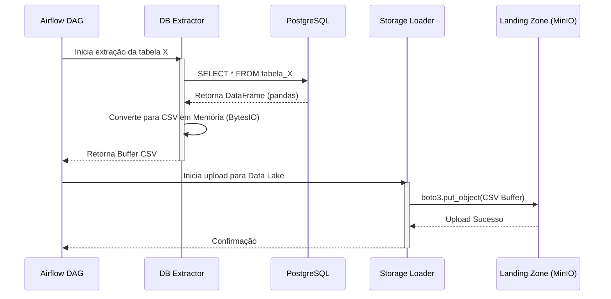

# 📥 Orquestração e Ingestão (Landing Zone)

A etapa de ingestão deste projeto foi construída utilizando o **Apache Airflow** como orquestrador principal, garantindo automação e resiliência na movimentação de dados.

!!! success "Requisito Cumprido"
    Nenhuma tarefa de movimentação utiliza cron jobs do Linux ou agendadores de tarefas do sistema operacional. Toda orquestração é centralizada e rastreável.

---

## 🏗️ Arquitetura da Ingestão

O pipeline extrai dados do banco transacional (PostgreSQL) e os carrega na primeira camada do nosso Data Lake (Landing Zone), instanciado no MinIO.

A DAG (`ingestao_landing_zone.py`) foi projetada de forma modular e dinâmica:

1.  **Geração Dinâmica de Tasks:** A lista contendo as 10 tabelas geradas na origem é percorrida em loop, gerando uma tarefa (`PythonOperator`) isolada para cada tabela. Se uma falhar, as outras continuam.
2.  **Separação de Responsabilidades:** O código do Airflow não contém lógicas pesadas. Todas as conexões e transformações estão abstraídas na pasta `dags/utils/`.

### Fluxo de Extração

---

## 📜 Formato Bruto Original

Uma das premissas arquiteturais da **Arquitetura Medalhão** adotada pelo projeto é que os dados na camada Landing sejam gravados em seu formato bruto original.

!!! info "Decisão de Design"
    Como a nossa origem de dados é um banco relacional em SQL, os dados são convertidos e persistidos como `.csv`.

Para otimizar o processo, a conversão para CSV é feita em **buffer de memória** (`io.BytesIO`) através da biblioteca Pandas. O dado é lido do PostgreSQL para a memória RAM e enviado diretamente via API (boto3) para o MinIO, **sem criar arquivos temporários em disco**.

---

## 🛡️ Validação de Qualidade (Data Quality)

Antes do upload para o MinIO, o módulo `db_extractor.py` executa uma validação na tabela extraída:

*   **Verificação de Tabela Vazia:** O script analisa se a propriedade `.empty` do DataFrame é verdadeira.
*   **Ação:** Caso a tabela não contenha registros (0 linhas), um erro intencional (`ValueError`) é lançado, abortando a task no Airflow.

!!! tip "Economia de Storage"
    Essa validação evita que o Data Lake seja poluído com arquivos inúteis, garantindo que apenas arquivos com conteúdo sejam processados pelas camadas seguintes.
