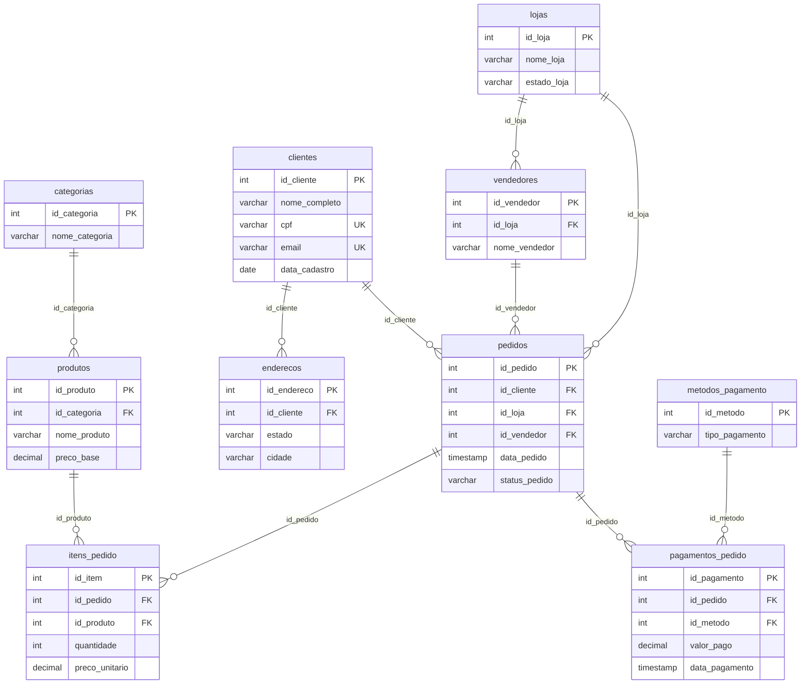
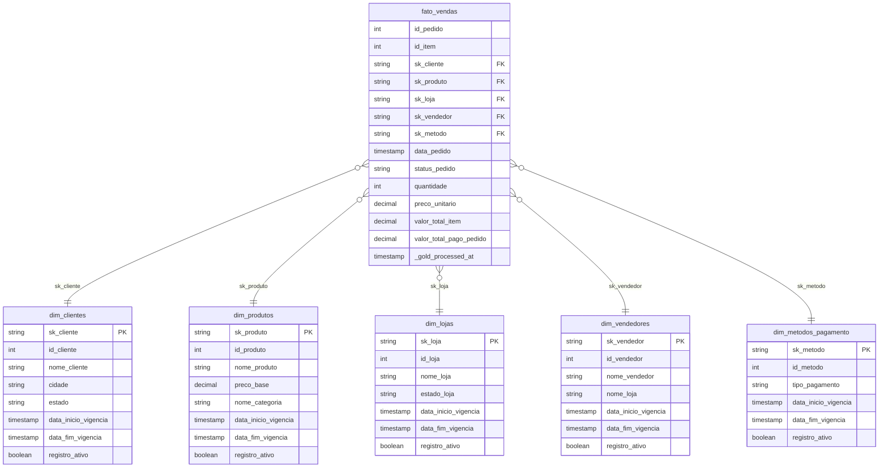

# 📐 Modelo de Dados

## Banco de Origem (PostgreSQL)

O banco `ecommerce_db` possui **10 tabelas** divididas entre tabelas dimensionais e tabelas fato.

### Diagrama Entidade-Relacionamento

---

## Star Schema (Camada Gold)

Na camada Gold, os dados são organizados em um modelo **Star Schema** otimizado para análise.

---

## Tabelas Dimensão (SCD Tipo 2)

!!! info "Slowly Changing Dimension Tipo 2"
    Todas as dimensões implementam SCD2, mantendo histórico completo de alterações.

| Tabela | Chave Substituta | Fonte Silver | Colunas Rastreadas |
|---|---|---|---|
| `dim_clientes` | `sk_cliente` (MD5) | `clientes` + `enderecos` | `nome_completo`, `cidade`, `estado` |
| `dim_produtos` | `sk_produto` (MD5) | `produtos` + `categorias` | `nome_produto`, `preco_base`, `nome_categoria` |
| `dim_lojas` | `sk_loja` (MD5) | `lojas` | `nome_loja`, `estado_loja` |
| `dim_vendedores` | `sk_vendedor` (MD5) | `vendedores` + `lojas` | `nome_vendedor`, `nome_loja` |
| `dim_metodos_pagamento` | `sk_metodo` (MD5) | `metodos_pagamento` | `tipo_pagamento` |

---

## Tabela Fato

| Tabela | Grão | Fonte Silver | Métricas |
|---|---|---|---|
| `fato_vendas` | Item de pedido (`id_item`) | `pedidos` + `itens_pedido` + `pagamentos_pedido` | `valor_total_item`, `valor_total_pago_pedido` |

---

## Volume de Dados

| Tabela | Registros Aproximados |
|---|---|
| `categorias` | ~10 |
| `produtos` | ~200 |
| `clientes` | ~500 |
| `enderecos` | ~500 |
| `lojas` | ~5 |
| `vendedores` | ~20 |
| `metodos_pagamento` | ~4 |
| `pedidos` | ~10.000+ |
| `itens_pedido` | ~26.000+ |
| `pagamentos_pedido` | ~10.000+ |
