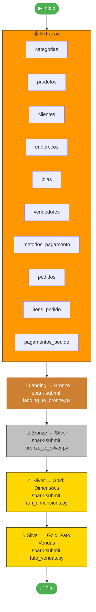

# 🔄 Orquestração — Apache Airflow

## Visão Geral

O **Apache Airflow** é o orquestrador central do pipeline. Todas as etapas — desde a extração do PostgreSQL até a carga na camada Gold — são executadas automaticamente pela DAG principal.

!!! success "Sem cron jobs"
    Nenhuma tarefa utiliza cron do Linux ou Agendador de Tarefas do Windows. Toda a orquestração é feita pelo Airflow.

---

## DAG Principal

**Nome:** `orquestracao_medalhao_end_to_end`  
**Agendamento:** `@daily`  
**Arquivo:** `dags/ingestao_landing_zone.py`

### Fluxo de Execução



---

## Etapas da DAG

### 1. Extração (PostgreSQL → Landing)

!!! note "10 tasks paralelas"
    Uma task `PythonOperator` é gerada dinamicamente para cada tabela. Se uma falhar, as demais continuam.

- **Método:** `pandas` + `SQLAlchemy` para leitura, `boto3` para upload ao MinIO
- **Formato de saída:** CSV bruto
- **Destino:** `s3a://landing/<tabela>/<tabela>_raw.csv`
- **Validação:** Tabelas vazias lançam `ValueError`, abortando a task

### 2. Landing → Bronze

- **Job:** `spark-submit pipeline/landing_to_bronze.py`
- **Lógica:** Lê CSV, adiciona colunas de auditoria, grava em Delta Lake (append)
- **Schema:** Todas as colunas como `StringType`

### 3. Bronze → Silver

- **Job:** `spark-submit pipeline/bronze_to_silver.py`
- **Lógica:** Deduplica, tipa, aplica regras de qualidade, grava via MERGE (upsert)
- **Schema:** Tipos corretos conforme `schemas.py`

### 4. Silver → Gold: Dimensões

- **Job:** `spark-submit gold/run_dimensions.py`
- **Lógica:** Aplica SCD Tipo 2 em 5 dimensões

### 5. Silver → Gold: Fato Vendas

- **Job:** `spark-submit gold/facts/fato_vendas.py`
- **Lógica:** Carga incremental via checkpoints, join temporal com dimensões

---

## Acesso ao Airflow

| Propriedade | Valor |
|---|---|
| **URL** | [http://localhost:8080](http://localhost:8080) |
| **Usuário** | `admin` |
| **Senha** | `admin` |
| **Executor** | `LocalExecutor` |

---

## Como Executar a DAG

1. Acesse **http://localhost:8080** e faça login
2. Localize a DAG `orquestracao_medalhao_end_to_end`
3. Ative clicando no **toggle** (deve ficar azul)
4. Clique em **Trigger DAG** (ícone ▶)
5. Acompanhe em **Graph View**

!!! warning "Tempo de execução"
    A execução completa leva entre **5 e 15 minutos** dependendo do hardware.

---

## Módulos Auxiliares

```
dags/
├── ingestao_landing_zone.py   # DAG principal
└── utils/
    ├── config.py              # Credenciais PostgreSQL + MinIO
    ├── db_extractor.py        # Extração PostgreSQL → buffer
    └── storage_loader.py      # Upload buffer → MinIO
```

| Módulo | Responsabilidade |
|---|---|
| `config.py` | Centraliza credenciais dos containers Docker |
| `db_extractor.py` | Lê tabela do PostgreSQL via pandas, valida dados e retorna buffer CSV |
| `storage_loader.py` | Recebe buffer e faz upload via boto3 para o MinIO |
