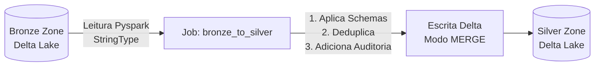

# 🥈 Camada Silver (Bronze → Silver)

A camada **Silver** armazena dados filtrados, limpos e enriquecidos. É nesta etapa que garantimos a tipagem e a remoção de duplicidade, transformando o "lago sujo" em uma base confiável para exploração corporativa.

---

## 🎯 Responsabilidade

A Silver processa as tabelas da Bronze aplicando:

1.  **Tipagem de Colunas (Casting):** Conversão de `StringType` para os tipos reais (Integer, Decimal, Timestamp).
2.  **Deduplicação:** Mantém apenas o registro mais recente para cada Chave Primária (PK).
3.  **Data Quality Simples:** Validações básicas e descarte de corrompidos ou chaves nulas.
4.  **Upsert (MERGE):** Grava na Silver usando operação Delta Lake MERGE — se existe atualiza, se não existe insere.

### Fluxo de Transformação



---

## 🧩 Schema Enforcement

Os tipos corretos de cada tabela estão declarados em um arquivo central chamado `schemas.py`. O Job Silver importa o schema correspondente, realiza o cast, e descarta colunas não mapeadas.

**Exemplo de Tipagem (tabela produtos):**
```python
"produtos": StructType([
    StructField("id_produto", IntegerType(), True),
    StructField("id_categoria", IntegerType(), True),
    StructField("nome_produto", StringType(), True),
    StructField("preco_base", DecimalType(10, 2), True)
])
```

---

## 🔄 Deduplicação e MERGE

Como a Bronze é _append-only_, o mesmo registro (mesmo ID) pode aparecer várias vezes. O PySpark na Silver deduplica pela PK, mantendo apenas a **linha com a data de ingestão mais recente**.

```python
# Janela para manter apenas o registro mais novo por ID
window_spec = Window.partitionBy(primary_key).orderBy(col("_ingestion_timestamp").desc())
df_deduplicado = df_with_schema.withColumn("row_number", row_number().over(window_spec)) \
                               .filter(col("row_number") == 1) \
                               .drop("row_number")
```

A gravação no Delta Silver é feita com a operação `MERGE INTO` da API DeltaTable. Isso garante o _Upsert_: reflete na Silver apenas a última fotografia da origem.

---

## 🔍 Colunas de Auditoria Silver

Cada registro atualizado ganha o timestamp da sua passagem pela Silver:

| Coluna | Tipo | Descrição |
|--------|------|-----------|
| `_silver_processed_at` | `timestamp` | Data/hora em que o registro foi consolidado na Silver |

---

## ⚙️ Como Executar

=== "Processar Tabela Específica"

    ```bash
    spark-submit pipeline/bronze_to_silver.py --table produtos
    ```

=== "Processar Todas (Desenvolvimento)"

    Conveniente para testes locais, processa as 10 tabelas de uma vez:
    ```bash
    python pipeline/run_all_tables.py silver
    ```

---

## 💾 Armazenamento

Os dados tipados são gravados no MinIO no path:

```
s3a://silver/<nome_da_tabela>/
```
